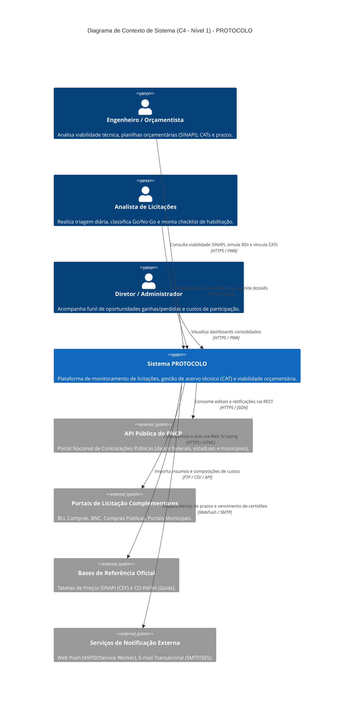
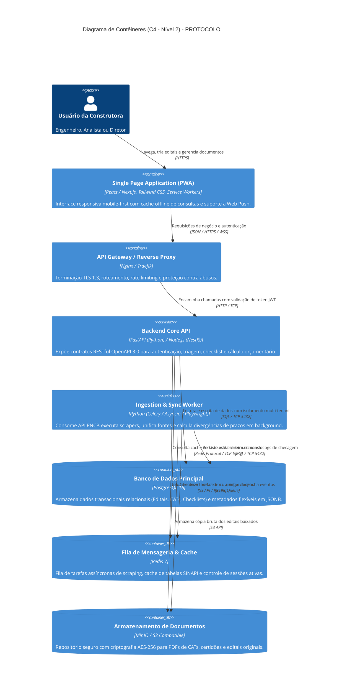
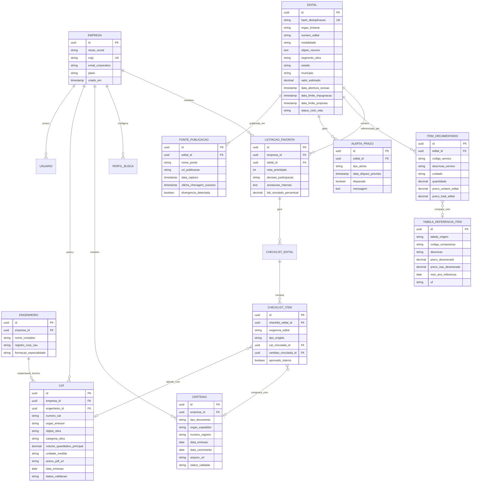
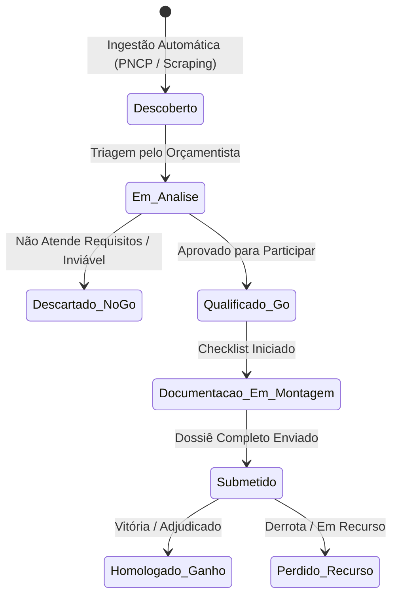
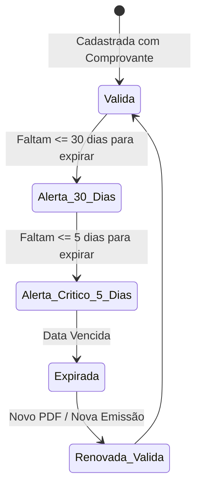

# PROTOCOLO — Documento de Arquitetura de Software (DAS)
**Versão:** 1.0  
**Data:** Setembro de 2026  
**Responsável Técnico:** Pedro (Tech Lead & Arquiteto de Software — M2)  
**Projeto:** PROTOCOLO — Plataforma de Monitoramento de Licitações e Habilitação Técnica

---

## 1. Visão Geral e Objetivos do Sistema

O **PROTOCOLO** é uma plataforma concebida para sanar o gargalo operacional enfrentado por construtoras de pequeno e médio porte na participação em licitações públicas no Brasil (com ênfase inicial em obras civis, infraestrutura viária e reformas no Estado de Goiás e região Centro-Oeste).

### 1.1 Metas Arquiteturais Primárias
1. **Agregação e Ingestão Resiliente:** Coleta periódica de editais via API oficial do PNCP (Portal Nacional de Contratações Públicas) e rotinas automatizadas de web scraping para portais complementares (BLL Compras, BNC, Compras Públicas), tolerando falhas externas e controlando a defasagem temporal de dados (**RF-01 a RF-04, RNF-09**).
2. **Deduplicação de Oportunidades:** Identificação algorítmica de editais idênticos publicados simultaneamente em múltiplas plataformas (**RF-03**).
3. **Módulo Protocolo — CAT como Entidade de Primeira Classe:** Centralização de Certidões de Acervo Técnico (CAT), engenheiros responsáveis, atestados com quantitativos executados, validade de licenças/certidões negativas e geração dinâmica de dossiês de habilitação (**RF-15 a RF-19**).
4. **Verificação Cruzada de Prazos e Alertas:** Monitoramento de divergências entre fontes oficiais e emissão de alertas precoces para impugnações, esclarecimentos e sessões públicas (**RF-12 a RF-14**).
5. **Apoio à Viabilidade Financeira:** Painel comparativo entre a planilha orçamentária do edital e tabelas de referência governamentais (SINAPI e CO-INFRA), com simulação paramétrica de BDI (**RF-20 a RF-22**).
6. **Evolução Mobile-First:** MVP disponibilizado via Web Responsiva e Progressive Web App (PWA) com Web Push, desacoplado de modo que a API RESTful sirva futuramente ao aplicativo mobile nativo (Fase 2) sem refatoração (**RNF-01 a RNF-04**).

---

## 2. Visão Arquitetural C4 Model

A arquitetura do PROTOCOLO adota o padrão **Modular Monolith orientado a eventos assíncronos**, desacoplando o tráfego de usuários interativos do processamento pesado de ingestão de dados e parsing de editais.

### 2.1 C4 — Nível 1: Diagrama de Contexto do Sistema

O diagrama abaixo ilustra os usuários finais, os limites do sistema PROTOCOLO e as entidades externas com as quais o sistema interage:



---

### 2.2 C4 — Nível 2: Diagrama de Contêineres

O sistema é estruturado em contêineres independentes e conteinerizados via Docker:



---

### 2.3 C4 — Nível 3: Diagrama de Componentes dos Módulos Principais

#### 2.3.1 Subsistema de Ingestão e Deduplicação (Responsável: Rafael — M3)
O pipeline garante que a indisponibilidade de um portal não afete o restante e trata editais repetidos:

```mermaid
graph TD
    subgraph Pipeline de Ingestão e Normalização
        A[Scheduler Cron] -->|Dispara a cada 30 min| B[Task Dispatcher]
        B --> C[PNCP Connector]
        B --> D[BLL Compras Scraper]
        B --> E[BNC / Portais Municipais Scraper]

        C -->|Raw JSON| F[Normalizer Engine]
        D -->|Raw HTML| F
        E -->|Raw HTML| F

        F -->|Objeto Unificado| G[Deduplication Matcher]
        G -->|Cálculo de Similaridade e Chave Única| H{Edital Já Existe?}
        
        H -->|Sim| I[Link Fonte Adicional & Checa Divergência de Prazos]
        H -->|Não| J[Cadastra Novo Edital e Cria Alertas Iniciais]

        I --> K[(PostgreSQL: Edital / FontePublicacao / AlertaPrazo)]
        J --> K
    end
```



#### 2.3.2 Subsistema de Domínio e Módulo Protocolo (Responsável: Matheus — M4)
Centraliza a regra de negócio da CAT e conformidade documental:

```mermaid
graph TD
    subgraph Módulo Protocolo & Viabilidade
        L[API Controller: /api/v1/protocolo] --> M[CAT Service]
        L --> N[Certidao Monitor Service]
        L --> O[Checklist Builder Service]
        L --> P[SINAPI / BDI Comparator Engine]

        M -->|Valida ART/CREA e quantitativos| Q[(Entidade CAT)]
        N -->|Checa validade (30d, 15d, 5d)| R[(Entidade Certidão)]
        O -->|Vincula CATs e Certidões exigidas| S[(Checklist do Edital)]
        P -->|Cruza itens com tabela vigente| T[(Tabela Referência)]
    end
```

---

## 3. Registros de Decisões Arquiteturais (ADRs)

### ADR-01: Modelo de Armazenamento Híbrido (PostgreSQL Relacional + JSONB + MinIO)
- **Status:** Aprovado.
- **Contexto:** Editais de órgãos municipais possuem estruturas extremamente variáveis (anexos em formatos diversos, tabelas sem padrão e campos personalizados), enquanto o relacionamento entre Construtora, CATs, Engenheiros e Checklists é altamente relacional e sensível a integridade referencial.
- **Decisão:** Adotar **PostgreSQL 16** como banco principal, usando tabelas relacionais fortemente tipadas para o domínio (`Empresa`, `Usuario`, `CAT`, `Certidao`, `ChecklistEdital`) e colunas `JSONB` indexadas via GIN para os atributos dinâmicos do edital (`metadados_especificos`, `campos_orgao`). Os arquivos físicos de editais e comprovantes de CAT são guardados no **MinIO/S3**.
- **Consequências:** Integridade transacional garantida onde mais importa, sem perder a agilidade de absorver formatos imprevisíveis de novos portais de licitação.

### ADR-02: Mensageria Assíncrona e Resiliência de Scraping (Redis + Celery + Circuit Breaker)
- **Status:** Aprovado.
- **Contexto:** A coleta de portais públicos e privados frequentemente enfrenta quedas, lentidões de até 40 segundos e bloqueios de IP. O usuário não pode ter sua navegação travada por essas oscilações.
- **Decisão:** Todas as coletas rodam de forma assíncrona desacopladas da API pública via **Redis e Celery Workers**. O conector de cada portal implementa o padrão **Circuit Breaker** (interrompe temporariamente requisições se houver 5 falhas consecutivas) e **Exponential Backoff** com jitter.
- **Consequências:** A API responde em menos de 200ms para o usuário final, e cada portal tem seu log de defasagem registrado individualmente (`ultima_checagem_sucesso`).

### ADR-03: Multi-Tenancy Lógico com RLS (Row Level Security) e Isolamento LGPD
- **Status:** Aprovado.
- **Contexto:** Informações sobre quais licitações uma construtora está participando, suas anotações estratégicas e seus acervos técnicos (CATs) são informações comerciais altamente sigilosas.
- **Decisão:** Implementação de arquitetura multi-tenant lógica onde toda consulta e gravação inclui obrigatoriamente o `tenant_id` (ID da Construtora), reforçado por **Row Level Security (RLS)** nativo do PostgreSQL e autenticação stateless via tokens JWT assinados com chave assimétrica (RS256).
- **Consequências:** Risco zero de vazamento cruzado de dados entre construtoras concorrentes, em total conformidade com a LGPD e RNF-12.

---

## 4. Diagrama Entidade-Relacionamento (DER)

O modelo de dados posiciona a **CAT (Certidão de Acervo Técnico)** como entidade de primeira classe de negócio:



---

## 5. Máquinas de Estados Centrais

### 5.1 Ciclo de Vida da Oportunidade / Edital


### 5.2 Ciclo de Monitoramento de Validade da CAT e Certidões


---

## 6. Estratégia de Segurança, Criptografia e LGPD

- **TLS 1.3 Obrigatório:** Toda comunicação externa e de PWA utiliza exclusivamente cifras seguras modernas.
- **Criptografia em Repouso:** Os documentos no Object Storage (MinIO) utilizam criptografia server-side via SSE-S3 / AES-256. Senhas são protegidas com `Argon2id`.
- **Rastreabilidade e Log de Auditoria:** Qualquer ação de alteração de nota de prioridade, exclusão de certidão ou inclusão de anotação gera evento imutável com data, hora, IP e usuário responsável.
- **Conformidade LGPD:** Os dados pessoais de engenheiros técnicos (CREA, CPF, e-mails de contato) são categorizados com flags de privacidade e podem ser anonimizados mediante solicitação expressa do titular.

---

## 7. Estratégia de Implantação e DevOps

- **Contêineres de Desenvolvimento:** `docker-compose.yml` com serviços pré-configurados: `api`, `frontend`, `db`, `redis`, `worker` e `minio`.
- **Pipeline de Integração Contínua (CI/CD):**
  1. *Linting & Typecheck:* Ruff / ESLint + TypeScript strict mode.
  2. *Pirâmide de Testes:* Testes unitários com pytest/Jest para validação de prazos, cálculo de BDI e deduplicação de editais. Cobertura mínima de 70% (**RNF-17**).
  3. *Security Scan:* Trivy e pip-audit em containers Docker.
  4. *Deploy Automatizado:* Build de imagens e publicação em ambiente staging/produção.
