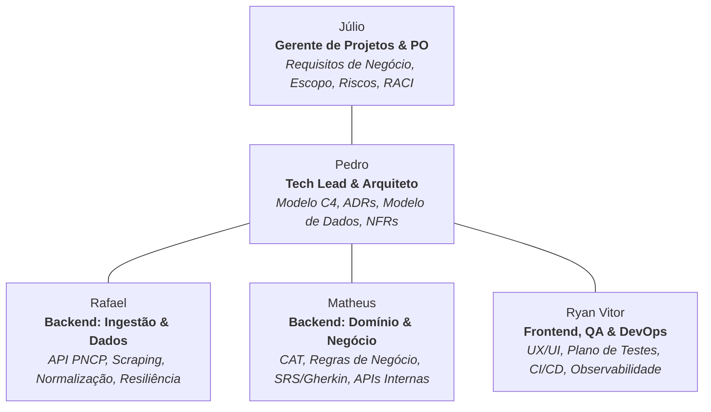
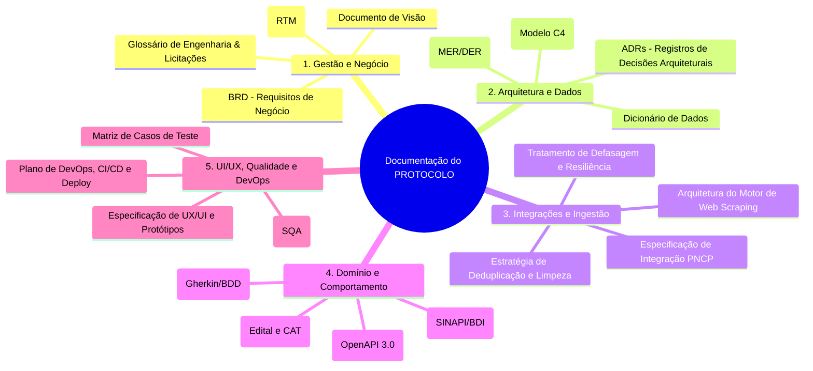
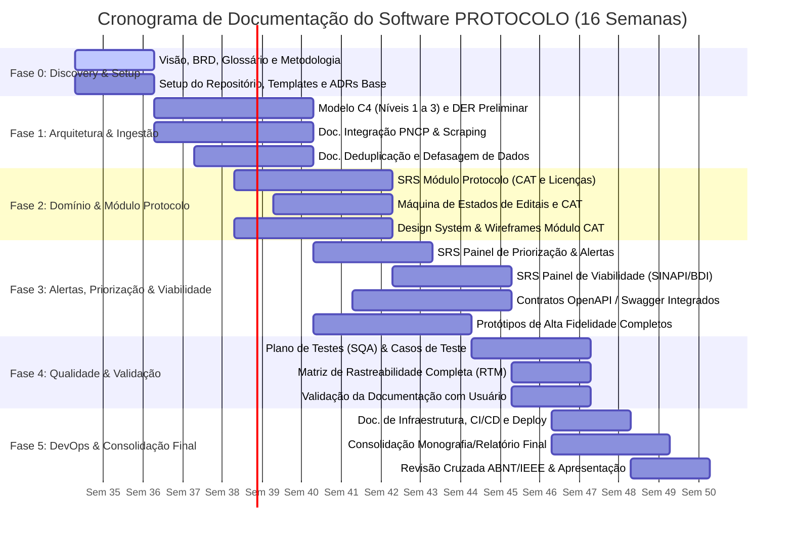

# PROTOCOLO — Planejamento de Escopo e Cronograma de Documentação de Software (Projeto Acadêmico)

---

## 1. Visão Geral e Contexto Acadêmico

### 1.1 Identificação do Projeto
- **Nome do Projeto:** PROTOCOLO — Plataforma de Gestão e Monitoramento de Licitações e Habilitação Técnica
- **Natureza:** Projeto Acadêmico de Engenharia de Software 
- **Duração:** 16 Semanas (1 Semestre Letivo / 8 Sprints quinzenais)
- **Tamanho da Equipe:** 5 Integrantes

### 1.2 Problema Central e Justificativa (Baseado na Entrevista Real)
1. **Fragmentação Extrema:** Mais de 30 portais de compras; o usuário monitora pelo menos 7 e gasta cerca de R$ 1.500/mês sem garantia de resultado.
2. **Tempo Operacional Elevado:** No mínimo 2 horas diárias dedicadas à busca manual e triagem em planilhas.
3. **Perda de Prazos Críticos:** Falhas em serviços existentes geram perda de oportunidades reais de faturamento.
4. **Gargalo Documental (CAT):** A Certidão de Acervo Técnico (CAT) é o documento central de habilitação, e remontar a documentação para cada edital (sem padronização entre municípios/órgãos) é o maior retrabalho diário.
5. **Apoio à Decisão Financeira:** A viabilidade financeira (BDI, tabelas SINAPI/CO-INFRA) requer análise especializada do engenheiro, exigindo um painel de apoio comparativo (não decisão automatizada).

### 1.3 Objetivo do Trabalho Acadêmico
Desenvolver a **documentação completa e formal de Engenharia de Software** do sistema PROTOCOLO, abrangendo: Engenharia de Requisitos, Modelagem Arquitetural (C4 Model / UML), Engenharia de Dados e Ingestão, Especificação de Domínio (Gherkin/BDD), Contratos de API (OpenAPI 3.0), Design de Interface (UI/UX), Plano de Garantia da Qualidade (SQA/Testes) e Diretrizes de DevOps.

---

## 2. Estrutura e Papéis da Equipe Acadêmica (5 Integrantes)

### Atribuições dos Membros:
1. **Júlio — Gerente de Projetos & Product Owner (GP/PO):**
   - Gestão ágil, controle de prazos e escopo, Documento de Visão (Vision Doc), Requisitos de Negócio (BRD), Glossário Técnico e Matriz de Rastreabilidade (RTM).
2. **Pedro — Tech Lead & Arquiteto de Software:**
   - Documento de Arquitetura de Software (DAS) em Modelo C4, Registros de Decisões Arquiteturais (ADRs), Diagrama Entidade-Relacionamento (DER Lógico/Físico) e Dicionário de Dados.
3. **Rafael — Engenheiro de Backend (Ingestão & Dados):**
   - Especificação técnica da integração PNCP, arquitetura dos scrapers para portais municipais/estaduais (BLL, BNC), algoritmos de deduplicação/normalização e tratamento de defasagem de dados.
4. **Matheus — Engenheiro de Backend (Domínio & Regras de Negócio):**
   - Especificação de Requisitos de Software (SRS) em Gherkin/BDD, Máquina de Estados (Edital e CAT), contratos REST OpenAPI 3.0 e regras do comparativo financeiro (SINAPI/BDI).
5. **Ryan Vitor — Engenheiro de Frontend, UX/UI & QA/DevOps:**
   - Mapa de Navegação, Design System e Protótipos de Alta Fidelidade (Figma), Plano de Garantia da Qualidade (SQA / Casos de Teste) e Arquitetura de CI/CD e Implantação (Docker/Kubernetes).

---

## 3. Escopo da Documentação (Estrutura Analítica do Projeto / EAP)

### 3.1 Lista de Artefatos a Serem Produzidos
- **DOC-01: Documento de Visão (Vision Doc):** Declaração do problema, personas, proposta de valor e escopo do MVP.
- **DOC-02: Documento de Requisitos de Negócio (BRD):** Dores da entrevista mapeadas em necessidades de negócio com métricas de impacto.
- **DOC-03: Glossário de Domínio:** Vocabulário técnico de licitações públicas e engenharia civil (CAT, BDI, SINAPI, PNCP, SICAF, etc.).
- **DOC-04: Matriz de Rastreabilidade de Requisitos (RTM):** Ligação bidirecional de *Dores $\leftrightarrow$ Requisitos $\leftrightarrow$ Arquitetura $\leftrightarrow$ Testes*.
- **DOC-05: Documento de Arquitetura de Software (DAS):** Modelo C4 (Níveis 1, 2 e 3) e requisitos não-funcionais (NFRs).
- **DOC-06: Caderno de ADRs (Architecture Decision Records):** Justificativas técnicas de banco de dados, mensageria e autenticação.
- **DOC-07: Modelagem e Dicionário de Dados:** DER Conceitual, Lógico e Físico das entidades principais (`Edital`, `CAT`, `ItemOrcamentario`, `AlertaPrazo`).
- **DOC-08: Especificação de Integração PNCP:** Mapeamento de endpoints públicos, paginação, rate-limit e payloads.
- **DOC-09: Arquitetura de Coleta Multi-Portal (Scraping):** Estratégia de extração, tolerância a falhas e circuit breakers.
- **DOC-10: Pipeline de Deduplicação e Normalização:** Regras para unificação de editais replicados em diferentes portais.
- **DOC-11: Especificação de Monitoramento de Defasagem de Dados:** Tratamento de latência e cálculo do timestamp de "última verificação".
- **DOC-12: Especificação de Requisitos de Software (SRS / BDD):** Cenários funcionais descritos em Gherkin (`Dado / Quando / Então`).
- **DOC-13: Diagrama de Máquinas de Estados:** Ciclos de vida do Edital e da Validade de Certidões/CAT.
- **DOC-14: Contrato de APIs Internas (OpenAPI 3.0 / Swagger):** Especificação completa das rotas REST de domínio.
- **DOC-15: Guia de UX/UI & Protótipos:** Design system, fluxo de navegação e telas de alta fidelidade no Figma.
- **DOC-16: Plano de Garantia da Qualidade (SQA & Testes):** Estratégia de testes, suítes de teste funcionais e não-funcionais.
- **DOC-17: Documentação de DevOps & CI/CD:** Pipelines de build/test, conteinerização e estratégia de observabilidade.
- **DOC-18: Relatório Técnico / Monografia Final:** Consolidação acadêmica no padrão ABNT / IEEE.

---

## 4. Matriz de Responsabilidades (RACI)

Legenda: **R** = Responsável (Redige) | **A** = Aprovador (Valida) | **C** = Consultado | **I** = Informado

| Código | Artefato de Documentação | M1 (GP/PO) | M2 (Arquiteto) | M3 (Backend Dados) | M4 (Backend Domínio) | M5 (UX/QA/DevOps) |
| :--- | :--- | :---: | :---: | :---: | :---: | :---: |
| **DOC-01** | Documento de Visão (Vision Doc) | **R / A** | C | I | C | I |
| **DOC-02** | Requisitos de Negócio (BRD) | **R / A** | C | C | C | C |
| **DOC-03** | Glossário de Domínio e Termos | **R / A** | C | C | C | C |
| **DOC-04** | Matriz de Rastreabilidade (RTM) | **R / A** | C | I | C | C |
| **DOC-05** | Arquitetura de Software (C4 Model) | I | **R / A** | C | C | C |
| **DOC-06** | Registro de Decisões (ADRs) | I | **R / A** | C | C | C |
| **DOC-07** | Modelagem de Dados (DER / Dicionário) | I | **R / A** | C | C | I |
| **DOC-08** | Especificação Integração PNCP | I | C | **R / A** | C | I |
| **DOC-09** | Mecanismo de Coleta e Scraping | I | C | **R / A** | I | I |
| **DOC-10** | Pipeline de Deduplicação e Limpeza | I | C | **R / A** | C | I |
| **DOC-11** | Monitoramento de Defasagem de Dados | I | C | **R / A** | I | C |
| **DOC-12** | SRS / Requisitos em Gherkin/BDD | C | C | I | **R / A** | C |
| **DOC-13** | Máquina de Estados (Edital e CAT) | C | C | I | **R / A** | C |
| **DOC-14** | Especificação OpenAPI / Swagger | I | C | C | **R / A** | C |
| **DOC-15** | Guia de UX/UI & Protótipos de Tela | C | I | I | C | **R / A** |
| **DOC-16** | Plano de Testes & Casos de Teste | I | C | C | C | **R / A** |
| **DOC-17** | Documento de DevOps & CI/CD | I | C | C | I | **R / A** |
| **DOC-18** | Relatório Técnico Acadêmico Final | **R / A** | R | R | R | R |

---

## 5. Cronograma Acadêmico (16 Semanas / 8 Sprints)

### 5.1 Fases e Marcos Acadêmicos (Milestones)

| Fase | Semanas | Foco Principal da Documentação | Responsáveis Chave | Entregável / Marco Acadêmico |
| :--- | :---: | :--- | :--- | :--- |
| **0. Discovery & Setup** | Sem. 1–2 | Visão, BRD, Glossário, setup do ambiente documental e ADRs iniciais | M1 (GP), M2 (Tech Lead) | **M0:** Proposta de Projeto e Documento de Visão Aprovados |
| **1. Arquitetura & Ingestão** | Sem. 3–6 | Modelo C4, DER Lógico, Integração PNCP, Scraping, Deduplicação | M2 (Arquiteto), M3 (Dados) | **M1:** Documento de Arquitetura (DAS) + Especificação de Ingestão |
| **2. Módulo Protocolo (CAT)** | Sem. 5–8 | SRS em Gherkin do CAT, Checklist por edital, Máquina de Estados, Wireframes | M4 (Domínio), M5 (UX) | **M2:** Especificação Funcional do Módulo Protocolo + Protótipos |
| **3. Priorização & Viabilidade** | Sem. 7–10 | SRS do Painel de Apoio Financeiro (SINAPI/BDI), Alertas Cruzados, OpenAPI | M4 (Domínio), M5 (UX), M2 | **M3:** Especificação Funcional Integral (SRS) + Contratos OpenAPI |
| **4. Qualidade & Validação** | Sem. 11–13 | Plano de Testes (SQA), Matriz de Rastreabilidade (RTM), Validação com Usuário | M5 (QA), M1 (GP), Todos | **M4:** Plano de Testes (SQA) + Rastreabilidade 100% Concluída |
| **5. DevOps & Defesa** | Sem. 14–16 | Doc. de DevOps/CI/CD, Consolidação da Monografia, Revisão ABNT e Apresentação | M5 (DevOps), M1 (GP), Todos | **M5:** Relatório Técnico Final + Apresentação da Banca |

---

## 6. Gestão de Riscos do Projeto Acadêmico

1. **Inconsistência entre Requisitos e Arquitetura:** Mitigado pelo uso contínuo da Matriz de Rastreabilidade (RTM) coordenada pelo GP (M1) e revisões semanais com o Arquiteto (M2).
2. **Complexidade Técnica das Fontes de Dados (PNCP/Scraping):** Mitigado pelo início imediato da documentação de ingestão na Fase 1 pelo Backend de Dados (M3), documentando estratégias de resiliência e rate limiting.
3. **Escopo Excessivo para o Semestre:** Mitigado pelo isolamento estrito dos itens "Fora do MVP" (heurísticas automáticas de fraude, logística de rotas e benchmarking de concorrentes).
4. **Desalinhamento com as Dores Reais do Usuário:** Mitigado pela validação de que a viabilidade orçamentária é um "painel de apoio consultivo" e o CAT é uma "entidade de primeira classe".

---

## 7. Diretrizes Metodológicas de Entrega Acadêmica

- **Repositório de Documentação:** Markdown versionado via Git com geração de documentação estática (ex: MkDocs / Docsify) ou template LaTeX para monografia acadêmica.
- **Rastreabilidade e Revisão por Pares (Peer Review):** Todo documento deve passar por Pull Request com aprovação de pelo menos um revisor antes de ser considerado "Pronto".
- **Normatização:** Padrão ABNT / IEEE para citações, diagramas C4 e especificação de requisitos em BDD.
