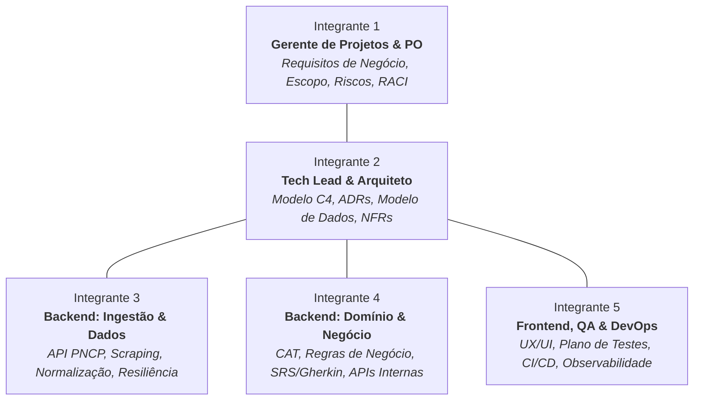
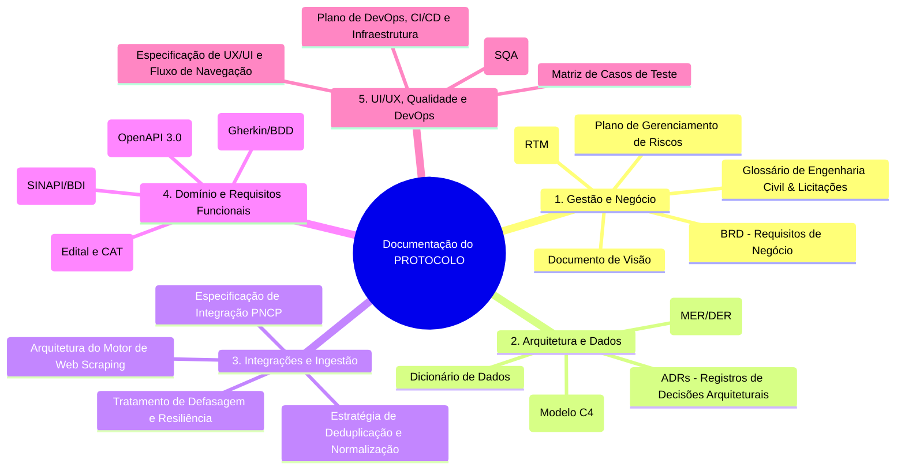
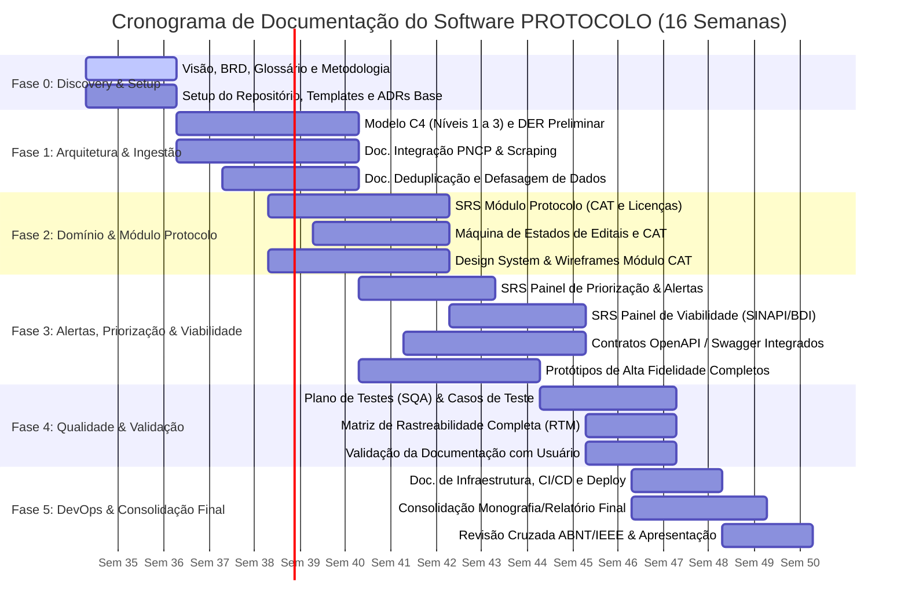

# PROTOCOLO — Planejamento de Escopo e Cronograma de Documentação de Software (Projeto Acadêmico)

---

## 1. Visão Geral e Contexto Acadêmico

### 1.1 Identificação do Projeto
- **Nome do Projeto:** PROTOCOLO — Plataforma de Gestão e Monitoramento de Licitações e Habilitação Técnica
- **Natureza:** Projeto Acadêmico de Engenharia de Software / Trabalho de Conclusão / Projeto Integrador
- **Duração:** 16 Semanas (1 Semestre Letivo / 8 Sprints quinzenais)
- **Tamanho da Equipe:** 5 Integrantes

### 1.2 Problema Central e Justificativa
Conforme revelado na pesquisa de descoberta com usuário real do setor de construção civil (obras de pequeno e médio porte):
1. **Fragmentação Extrema:** Existem mais de 30 portais públicos/privados de licitações; empresas chegam a pagar ~R$ 1.500/mês para monitorar cerca de 7 deles, sem garantia de cobertura completa.
2. **Tempo Operacional Excessivo:** Gasto mínimo de 2 horas diárias em busca e triagem manual de editais.
3. **Perda de Prazos Críticos:** Falhas de captura em serviços existentes de alerta geram perda de oportunidades de negócio.
4. **Gargalo Documental (CAT):** A Certidão de Acervo Técnico (CAT) é o elemento central de habilitação, e a remontagem de documentação para cada edital (sem padronização entre órgãos) gera alto retrabalho.
5. **Apoio à Viabilidade:** A viabilidade financeira (BDI, tabelas SINAPI/CO-INFRA) exige análise técnica especializada e conferência de distorções em tabelas oficiais.

### 1.3 Objetivo do Trabalho Acadêmico
Elaborar a **especificação formal e documentação integral de Engenharia de Software** para o sistema PROTOCOLO, contemplando desde a engenharia de requisitos, modelagem arquitetural (C4 Model / UML), especificação de integrações e APIs, modelagem de dados, design de interação (UI/UX), plano de testes até estratégias de DevOps e implantação.

---

## 2. Estrutura e Papéis da Equipe Acadêmica (5 Integrantes)

Para simular um ambiente profissional e garantir profundidade acadêmica, os 5 membros assumem especialidades complementares:

### Detalhamento dos Papéis:
1. **Integrante 1 — Gerente de Projetos & Product Owner (GP/PO):**
   - Condução da metodologia ágil, alinhamento de escopo, documentação de requisitos de negócio (BRD), Documento de Visão, matriz de rastreabilidade e gestão de riscos.
2. **Integrante 2 — Tech Lead & Arquiteto de Software:**
   - Decisões arquiteturais fundamentadas (ADRs), modelagem de arquitetura de software (Modelo C4, diagramas de implantação), modelagem do banco de dados (MER/DER) e requisitos não-funcionais.
3. **Integrante 3 — Engenheiro de Backend: Ingestão, Integrações & Dados:**
   - Engenharia de pipeline de dados, documentação de integração com PNCP e scraping de portais municipais/estaduais, regras de deduplicação, normalização e controle de defasagem.
4. **Integrante 4 — Engenheiro de Backend: Domínio, Negócio & APIs:**
   - Especificação funcional detalhada (SRS em formato BDD/Gherkin), máquina de estados do edital e do CAT, painel comparativo SINAPI/CO-INFRA, motor de alertas e documentação OpenAPI/Swagger.
5. **Integrante 5 — Engenheiro de Frontend, UX/UI & QA/DevOps:**
   - Especificação de interface e experiência (Design System, Wireframes, fluxo de telas), Plano de Testes de Software (SQA, casos de teste manuais e automatizados) e especificação da infraestrutura (Docker, CI/CD, monitoramento).

---

## 3. Escopo da Documentação (EAP / WBS da Documentação)

### 3.1 Entregáveis Detalhados por Módulo de Documentação

#### Bloco 1: Gestão de Projetos e Requisitos de Negócio (Responsável: Integrante 1)
- **DOC-01: Documento de Visão do Produto (Vision Doc):** Declaração do problema, personas (Engenheiro Orçamentista, Gestor de Contratos), proposta de valor e limites do produto.
- **DOC-02: Documento de Requisitos de Negócio (BRD):** Mapeamento das dores validadas na entrevista com métricas de sucesso (ex: redução de 2h para 15 min na triagem de editais).
- **DOC-03: Glossário Técnico-Regulatório:** Definição formal de termos como CAT (Certidão de Acervo Técnico), BDI (Benefícios e Despesas Indiretas), PNCP, SINAPI, CO-INFRA, Habilitação Jurídica e Qualificação Técnica.
- **DOC-04: Matriz de Rastreabilidade de Requisitos (RTM):** Mapeamento bidirecional: *Dor da Entrevista $\to$ Requisito de Negócio $\to$ Caso de Uso/User Story $\to$ Módulo do Sistema $\to$ Caso de Teste*.

#### Bloco 2: Arquitetura de Software e Dados (Responsável: Integrante 2)
- **DOC-05: Documento de Arquitetura de Software (DAS):** 
  - Modelo C4: Nível 1 (Contexto), Nível 2 (Contêineres), Nível 3 (Componentes dos serviços principais).
  - Padrões arquiteturais adotados (Modular Monolith / Microserviços orientados a eventos com Filas de Ingestão).
- **DOC-06: Coleção de ADRs (Architecture Decision Records):**
  - *ADR-01:* Estratégia de armazenamento (PostgreSQL com JSONB para editais dinâmicos vs MongoDB).
  - *ADR-02:* Mecanismo de mensageria assíncrona para scraping e processamento de editais (Redis Queue / RabbitMQ).
  - *ADR-03:* Estratégia de autenticação e controle de acesso multi-tenant.
- **DOC-07: Modelagem de Dados e Dicionário de Dados:**
  - Diagrama Entidade-Relacionamento (DER Lógico e Físico).
  - Entidades de Primeira Classe: `Edital`, `FontePublicacao`, `Licitante`, `CAT`, `ItemOrcamentario`, `TabelaReferencia` (SINAPI/CO-INFRA), `AlertaPrazo`.

#### Bloco 3: Engenharia de Ingestão, Integrações e Dados (Responsável: Integrante 3)
- **DOC-08: Especificação Técnica de Ingestão do PNCP:** Mapeamento de endpoints da API pública do Portal Nacional de Contratações Públicas, esquemas de payload, paginação e controle de rate-limiting.
- **DOC-09: Arquitetura do Mecanismo de Coleta Multi-Portal (Scraping):** Estratégia para portais estaduais/municipais (BLL, BNC, Compras Públicas), isolamento de falhas, retentativas exponenciais e circuit breakers.
- **DOC-10: Pipeline de Normalização e Deduplicação:** Algoritmo de cruzamento e identificação de editais duplicados publicados em múltiplos portais.
- **DOC-11: Especificação de Monitoramento de Defasagem de Dados:** Métricas de SLA para atualização de dados e exibição de "Última verificação bem-sucedida".

#### Bloco 4: Domínio, Regras de Negócio e APIs (Responsável: Integrante 4)
- **DOC-12: Especificação de Requisitos de Software (SRS) em BDD/Gherkin:**
  - Requisitos Funcionais estruturados em `Dado / Quando / Então` para os módulos:
    - Ingestão e Filtros por Tipo de Obra/Região.
    - Módulo Protocolo (Cadastro, validade e vínculos de CAT e Certidões).
    - Motor de Alertas com Verificação Cruzada de Prazos.
    - Painel de Apoio à Viabilidade Financeira (Comparação SINAPI x Edital).
- **DOC-13: Diagrama de Máquinas de Estados:**
  - Ciclo de vida de um Edital: `Descoberto` $\to$ `Em Análise` $\to$ `Qualificado (Go/No-Go)` $\to$ `Documentação em Montagem` $\to$ `Submetido` $\to$ `Resultado/Homologado`.
  - Ciclo de vida de uma CAT / Certidão: `Válida` $\to$ `Em Alerta de Vencimento` $\to$ `Expirada` $\to$ `Renovada`.
- **DOC-14: Especificação de APIs Internas (Swagger / OpenAPI 3.0):** Contratos REST completos para o frontend consumir os serviços de domínio e agregação.

#### Bloco 5: UI/UX, Qualidade (QA) e DevOps (Responsável: Integrante 5)
- **DOC-15: Documento de Design de Interface e Experiência (UI/UX):**
  - Mapa do Site e Fluxo de Navegação.
  - Wireframes e Protótipos de Alta Fidelidade (Dashboard de Priorização, Checklist por Edital, Comparador de BDI/SINAPI).
- **DOC-16: Plano de Garantia da Qualidade (SQA & Testes):**
  - Estratégia da Pirâmide de Testes (Unitários, Integração, E2E).
  - Casos de Teste detalhados para os requisitos críticos (alertas de prazo, validação de vencimento de CAT).
- **DOC-17: Documento de Arquitetura de Implantação e DevOps:**
  - Pipeline de CI/CD (GitHub Actions / GitLab CI).
  - Infraestrutura como Código / Containers (Docker Compose / Kubernetes).
  - Estratégia de Logs, Healthcheck e Monitoramento de Tarefas em Background (Cron / Worker Jobs).

---

## 4. Matriz de Responsabilidades (RACI)

Legenda:
- **R (Responsible):** Quem executa e redige a documentação.
- **A (Accountable):** Quem valida, aprova e responde pela consistência técnica do artefato.
- **C (Consulted):** Quem contribui com insumos técnicos ou validação cruzada.
- **I (Informed):** Quem precisa ser comunicado da finalização ou alteração do artefato.

| Código | Artefato de Documentação | M1 (GP/PO) | M2 (Arquiteto) | M3 (Backend Dados) | M4 (Backend Domínio) | M5 (UX/QA/DevOps) |
| :--- | :--- | :---: | :---: | :---: | :---: | :---: |
| **DOC-01** | Documento de Visão (Vision Doc) | **R / A** | C | I | C | I |
| **DOC-02** | Requisitos de Negócio (BRD) | **R / A** | C | C | C | C |
| **DOC-03** | Glossário de Domínio e Termos | **R / A** | C | C | C | C |
| **DOC-04** | Matriz de Rastreabilidade (RTM) | **R / A** | C | I | C | C |
| **DOC-05** | Arquitetura de Software (C4 Model) | I | **R / A** | C | C | C |
| **DOC-06** | Registro de Decisões (ADRs) | I | **R / A** | C | C | C |
| **DOC-07** | Modelagem de Dados (DER / Dicionário) | I | **R / A** | C | C | I |
| **DOC-08** | Especificação Integração PNCP | I | C | **R / A** | C | I |
| **DOC-09** | Mecanismo de Coleta e Scraping | I | C | **R / A** | I | I |
| **DOC-10** | Pipeline de Deduplicação e Limpeza | I | C | **R / A** | C | I |
| **DOC-11** | Monitoramento de Defasagem de Dados | I | C | **R / A** | I | C |
| **DOC-12** | SRS / Requisitos em Gherkin/BDD | C | C | I | **R / A** | C |
| **DOC-13** | Máquina de Estados (Edital e CAT) | C | C | I | **R / A** | C |
| **DOC-14** | Especificação OpenAPI / Swagger | I | C | C | **R / A** | C |
| **DOC-15** | Guia de UX/UI & Protótipos de Tela | C | I | I | C | **R / A** |
| **DOC-16** | Plano de Testes & Casos de Teste | I | C | C | C | **R / A** |
| **DOC-17** | Documento de DevOps & CI/CD | I | C | C | I | **R / A** |
| **DOC-18** | Relatório Técnico Acadêmico Final | **R / A** | R | R | R | R |

---

## 5. Cronograma Acadêmico Detalhado (16 Semanas / 8 Sprints)

O cronograma organiza as 16 semanas acadêmicas em 6 Fases principais, com entregas parciais planejadas para bancas ou marcos de avaliação (Milestones):

### 5.1 Detalhamento Semana a Semana

#### **Fase 0: Descoberta, Fundamentação e Setup (Semanas 1 a 2)**
* **Objetivo:** Estabelecer a base do projeto, formalizar o escopo da documentação e preparar o ambiente colaborativo.
* **Atividades:**
  - **M1:** Redação do Documento de Visão (`DOC-01`), BRD preliminar (`DOC-02`) e estruturação do Glossário (`DOC-03`).
  - **M2:** Definição do repositório de documentação (Markdown / MkDocs / LaTeX), padrões de formatação e template de ADRs.
  - **M3:** Levantamento preliminar dos endpoints do PNCP e portais municipais/estaduais identificados (BLL, BNC).
  - **M4:** Estruturação inicial das entidades do domínio de construção civil (CAT, BDI, certidões).
  - **M5:** Pesquisa de referências de UX para dashboards de licitação e montagem do repositório de testes.
* **Marco 0 (M0 - Semana 2):** *Proposta de Projeto Aprovada e Documento de Visão Concluído.*

---

#### **Fase 1: Arquitetura Base e Ingestão de Dados (Semanas 3 a 6)**
* **Objetivo:** Projetar a espinha dorsal arquitetural e detalhar os mecanismos de coleta e saneamento de dados.
* **Atividades:**
  - **M1:** Estruturação da Matriz de Rastreabilidade (`DOC-04`) conectando dores da pesquisa aos épicos.
  - **M2:** Elaboração do Documento de Arquitetura (`DOC-05`) com Diagramas C4 (Contexto e Contêiner) e DER Lógico (`DOC-07`). Redação de `ADR-01` e `ADR-02`.
  - **M3:** Redação da Especificação Técnica do PNCP (`DOC-08`), estratégia de Scraping (`DOC-09`) e algoritmos de deduplicação (`DOC-10`).
  - **M4:** Início da especificação de domínio para o motor de filtros (Tipo de Obra e Região).
  - **M5:** Wireframes conceituais do fluxo de busca e filtros de editais.
* **Marco 1 (M1 - Semana 6):** *Documento de Arquitetura de Software (DAS) + Especificação de Ingestão Entregues.*

---

#### **Fase 2: Módulo Protocolo (CAT e Licenciamentos) (Semanas 5 a 8)**
* **Objetivo:** Especificar o módulo central do software — gestão de certidões, validade de CAT e checklist documental.
* **Atividades:**
  - **M1:** Refinamento dos requisitos de conformidade documental e regras para checklist por órgão licitante.
  - **M2:** Modelagem detalhada das entidades `CAT`, `Certidao`, `LicencaAmbiental`, `Alvara` no Modelo Físico.
  - **M3:** Documentação do controle de defasagem de dados e rotinas de revalidação de fontes (`DOC-11`).
  - **M4:** Redação do SRS em BDD/Gherkin para o Módulo Protocolo (`DOC-12`) e Diagrama de Estados da CAT (`DOC-13`).
  - **M5:** Protótipos de média/alta fidelidade da tela de Gestão de CATs e montagem de Checklist por Edital (`DOC-15`).
* **Marco 2 (M2 - Semana 8):** *Especificação Completa do Módulo Protocolo & Protótipos de Tela de Documentação.*

---

#### **Fase 3: Painel de Priorização, Alertas e Viabilidade Financeira (Semanas 7 a 10)**
* **Objetivo:** Documentar as funcionalidades de apoio à tomada de decisão (substituição de planilhas manuais e análise de orçamentos).
* **Atividades:**
  - **M1:** Gestão de riscos de negócio e documentação do fluxo de decisão do usuário (Go/No-Go).
  - **M2:** Revisão arquitetural dos fluxos de dados do módulo financeiro e elaboração do C4 Component Diagram.
  - **M3:** Especificação de endpoints de busca/filtros consolidados e integração do agregador.
  - **M4:** Especificação detalhada em Gherkin do motor de alertas cruzados e da comparação com tabelas SINAPI/CO-INFRA. Redação dos contratos OpenAPI (`DOC-14`).
  - **M5:** Protótipos de alta fidelidade do Painel de Priorização e da tela comparativa de itens orçamentários/BDI.
* **Marco 3 (M3 - Semana 10):** *Especificação Funcional Integral (SRS) + Contratos de API (OpenAPI 3.0).*

---

#### **Fase 4: Garantia da Qualidade, Rastreabilidade e Validação (Semanas 11 a 13)**
* **Objetivo:** Especificar a estratégia de testes rigorosa e validar a documentação frente às necessidades reais levantadas na pesquisa.
* **Atividades:**
  - **M1:** Fechamento da Matriz de Rastreabilidade (`DOC-04`) garantindo 100% de cobertura de requisitos.
  - **M2:** Revisão de integridade arquitetural (Consistência entre DER, C4 e OpenAPI).
  - **M3 & M4:** Criação de cenários de teste de integração para pipelines de dados e regras de negócio de vencimento de prazos.
  - **M5:** Elaboração do Plano de Testes (SQA - `DOC-16`), especificando casos de teste unitários, de integração, E2E e testes de usabilidade.
  - **Toda a Equipe:** Sessão de validação da documentação estruturada comparando com as dores da entrevista de descoberta.
* **Marco 4 (M4 - Semana 13):** *Plano de Testes (SQA) + Matriz de Rastreabilidade 100% Mapeada.*

---

#### **Fase 5: DevOps, Consolidação Acadêmica e Defesa (Semanas 14 a 16)**
* **Objetivo:** Formalizar a infraestrutura de implantação, compilar o relatório técnico final no padrão acadêmico e ensaiar a apresentação.
* **Atividades:**
  - **M1:** Coordenação do relatório final, resumo executivo, introdução e conclusão acadêmica (`DOC-18`).
  - **M2:** Revisão técnica global e consolidação do Documento de Arquitetura.
  - **M3 & M4:** Revisão de consistência dos diagramas de sequência, dicionário de dados e endpoints.
  - **M5:** Redação da Documentação de DevOps (`DOC-17`), especificando pipeline de CI/CD e configuração de containers.
  - **Toda a Equipe:** Formatação final (normas ABNT/IEEE), geração de PDFs/slides e ensaio para a banca acadêmica.
* **Marco 5 (M5 - Semana 16):** *Entrega do Relatório Técnico Final + Apresentação para a Banca Acadêmica.*

---

## 6. Gestão de Riscos do Projeto Acadêmico

| Risco Identificado | Probabilidade | Impacto | Estratégia de Mitigação Acadêmica |
| :--- | :---: | :---: | :--- |
| **Desalinhamento entre Requisitos e Arquitetura** | Média | Alto | Adoção da Matriz de Rastreabilidade (RTM) obrigatória e revisões semanais entre GP (M1) e Tech Lead (M2). |
| **Complexidade das APIs do PNCP / Portais** | Alta | Médio | Backend de Dados (M3) inicia o isolamento de contratos e esquemas na Fase 1, usando mocks se houver instabilidade no portal público. |
| **Sobrecarga de documentação de testes** | Média | Médio | Integrante de QA/DevOps (M5) utilizará o padrão BDD fornecido por M4 para derivar os Casos de Teste diretamente dos cenários Gherkin. |
| **Atraso em entregas individuais** | Média | Alto | Sprints quinzenais com reuniões de checkpoint; cada documento possui sub-responsabilidades e revisão cruzada (Peer Review). |
| **Escopo muito extenso para o período** | Alta | Médio | Manter estritamente fora do MVP os módulos secundários (logística automatizada, heurística de fraude em planilhas e benchmarking histórico). |

---

## 7. Padrões de Qualidade e Critérios de Aceite da Documentação

1. **Rastreabilidade Total:** Todo requisito no SRS deve mapear diretamente para uma dor da pesquisa de descoberta e para pelo menos um caso de teste no Plano de Testes.
2. **Notação Padrão:**
   - Diagramas Arquiteturais: Modelo C4 e Notação UML 2.5 formal.
   - Requisitos Funcionais: Padrão BDD (Given/When/Then em Português).
   - Contratos de API: Especificação OpenAPI 3.0 / Swagger válida.
3. **Revisão por Pares (Peer Review):** Nenhum artefato é finalizado sem a aprovação do autor (R) e do validador (A/C) via Pull Request ou revisão formal de documento.
4. **Alinhamento com o Usuário Real:** Todas as decisões de escopo refletem o princípio validado de que a viabilidade financeira é um "painel de apoio", e o CAT é uma "entidade de primeira classe".
